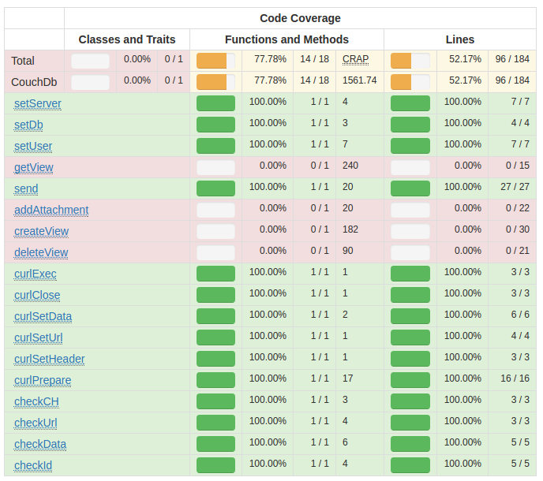

# CouchDb - a library for accessing couchDB easily

## Description

## Usage

## Test Coverage
- Functions and Methods: 77.78% - 14 / 18
- Lines: 52.17% - 96 / 184
 

## Requirements for PHPUnit testing
- CouchDb installed locally
- port: 5984
- user: phpunit
- pass: unittests
- db: unittests