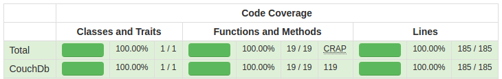

# CouchDb - a library for accessing couchDB easily

## Description
a little wrapper for curl calls to manage data by NoSql CouchDb. 

## Usage
<code>
$cdb = new CouchDb();

// set server and port 
$cdb->setServer($server = 'http://127.0.0.1', $port = 5984)

// set db 
$cdb->setDb($db)

// set user and pass (optional) 
$cdb->setUser($user, $pass)

// set response as object or json string (optional)
$cdb->setResponseAsObject($option = false)

// send data 
// method = PUT|GET|DELETE 
// id = document id 
// data = string containing data (optional) 
$cdb->send($method, $id, $data = null)

// add attachment to existing document 
$cdb->addAttachment($id, $filename)

// creates view 
// designName = string containing name 
// viewName = string containing name of View 
// script = string containting the javascript 
$cdb->createView($designName, $viewName, $script)

// deletes the view Part document 
// for deleting design document use send() with delete option 
$cdb->deleteView($designName, $viewName = null)

// gets data from a view
// filtering by Keyvalue at the url (?key=bla) 
$cdb->getView($design, $view, $keyValue = null)
</code>

## Test Coverage

## Requirements for PHPUnit testing
- curl installed for php
- CouchDb installed locally
- port: 5984
- user: phpunit
- pass: unittests
- db: unittests